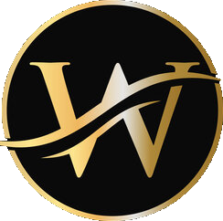

<a name="readme-top"></a>

<!--
HOW TO USE:
This is an example of how you may give instructions on setting up your project locally.

Modify this file to match your project and remove sections that don't apply.

REQUIRED SECTIONS:
- Table of Contents
- About the Project
  - Built With
  - Live Demo
- Getting Started
- Authors
- Future Features
- Contributing
- Show your support
- Acknowledgements
- License

OPTIONAL SECTIONS:
- FAQ

After you're finished please remove all the comments and instructions!
-->

<div align="center">
  <!-- You are encouraged to replace this logo with your own! Otherwise you can also remove it. -->
  
  <br/>

  <h3><b>Portfolio Project</b></h3>

</div>


# 📗 Table of Contents

- [📖 About the Project](#about-project)
  - [🛠 Built With](#built-with)
    - [Tech Stack](#tech-stack)
    - [Key Features](#key-features)
  - [🚀 Live Demo](#live-demo)
  - [💻 Project Presentation](#presentation)
- [💻 Getting Started](#getting-started)
  - [Setup](#setup)
  - [Prerequisites](#prerequisites)
- [👥 Authors](#authors)
- [🔭 Future Features](#future-features)
- [🤝 Contributing](#contributing)
- [⭐️ Show your support](#support)
- [🙏 Acknowledgements](#acknowledgements)
- [❓ FAQ (OPTIONAL)](#faq)
- [📝 License](#license)

<!-- PROJECT DESCRIPTION  -->

# 📖 Portfolio Project <a name="about-project"></a>

Introducing the **Portfolio Project** - a showcase of the incredible skills, experience, and achievements of Wondmagegn Chosha, a highly talented Software Engineer. With a passion for coding and a wealth of knowledge in the field, Wondmagegn has created a stunning portfolio that truly highlights his capabilities.

In this project, you'll find a comprehensive background on Wondmagegn, detailing his educational and professional experience. From his early days as a computer science student to his current role as a seasoned software engineer, Wondmagegn's journey is both inspiring and informative.

But that's not all - the Portfolio Project also features screenshots of Wondmagegn's best work, providing a glimpse into the innovative solutions he's developed throughout his career. From complex software systems to sleek mobile applications, Wondmagegn's expertise spans a wide range of technologies and platforms.

And if you're interested in collaborating with Wondmagegn or simply want to learn more about his work, his contact details are readily available within the project. Connect with him today and discover why he's a sought-after software engineer in the industry.

Overall, the Portfolio Project is a true testament to Wondmagegn's talent, dedication, and passion for software engineering. Explore it today and see for yourself why he's a force to be reckoned with in the field.

## 🛠 Built With <a name="built-with"></a>

### Tech Stack <a name="tech-stack"></a>
- HTML/CSS


<!-- Features -->

### Key Features <a name="key-features"></a>
- **Introduces the Wondmagegn Chosha**
- **Showcases his past works**
- **Provides his contact information**

<p align="right">(<a href="#readme-top">back to top</a>)</p>

<!-- LIVE DEMO -->

## 🚀 Live Demo <a name="live-demo"></a>
- Click <a href="https://wacoo.github.io/Portfolio-Project">here</a> to open the live demo.
<p align="right">(<a href="#readme-top">back to top</a>)</p>

## 💻 Project Presentation <a name="presentation"></a>
- Click <a href="https://www.loom.com/share/8e291776b29a440bbbfdfa1957b2daa4?sid=27d8459f-d153-4e59-b490-b8ce82c5109b">here</a> to open the presentation.
<p align="right">(<a href="#readme-top">back to top</a>)</p>
<!-- GETTING STARTED -->

## 💻 Getting Started <a name="getting-started"></a>
To get a local copy up and running, follow these steps.
- Open the index.html with a web browser (Chrome, Firefox, Safari...)

### Prerequisites

In order to run this project you need:
- A web browser (Chrome, Firefox, Safari...)
<!--
Example command:

```sh
 gem install rails
```
 -->

### Setup
- Clone the repository to desired directory on local computer
> `git clone https://github.com/wacoo/Portfolio-Project.git`

## 👥 Author <a name="authors"></a>
- GitHub: [@wacoo](https://github.com/wacoo)
- Twitter: [@wabaham9](https://twitter.com/wabaham9)
- LinkedIn: [LinkedIn](https://linkedin.com/in/wondmagegn-abriham-b867289a)

<p align="right">(<a href="#readme-top">back to top</a>)</p>

<!-- FUTURE FEATURES -->

## 🔭 Future Features <a name="future-features"></a>
- **Improve the page so it can be compatible to desktop devices**
- **Add more projects**
- **Imporve the look and feel further**

<p align="right">(<a href="#readme-top">back to top</a>)</p>

<!-- CONTRIBUTING -->

## 🤝 Contributing <a name="contributing"></a>

Contributions, issues, and feature requests are welcome!

Feel free to check the [issues page](../../issues/).

<p align="right">(<a href="#readme-top">back to top</a>)</p>

<!-- SUPPORT -->

## ⭐️ Show your support <a name="support"></a>

- I'm a freelance developer. If you like my work, please support me by spreading the word.

<p align="right">(<a href="#readme-top">back to top</a>)</p>

<!-- ACKNOWLEDGEMENTS -->

## 🙏 Acknowledgments <a name="acknowledgements"></a>

- I want to thank all my clients for their patronage.

<p align="right">(<a href="#readme-top">back to top</a>)</p>

<!-- FAQ (optional) -->

## ❓ FAQ (OPTIONAL) <a name="faq"></a>
- **How can I find you?**

  - Please find my contact information below.

- **Can you give me a price range for your services?**

  - To get price range, please contact me with: wabaham9@gmail.com

<p align="right">(<a href="#readme-top">back to top</a>)</p>

<!-- LICENSE -->

## 📝 License <a name="license"></a>

This project is [MIT](MIT.md) licensed.
